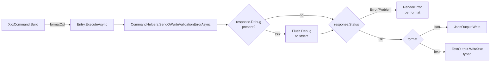

# feat: AI-optimized stdout format with `--format text|json`

## Summary

`dotnet aicraft` currently emits pretty-printed JSON on stdout for every command. Its primary consumer is Claude Code, for which the JSON shape is token-expensive on list-heavy results (`refs`, `symbols`, `callers`, `impls`, `unused`) and ignores the devtools conventions (ripgrep, MSBuild/Roslyn) LLMs natively parse. This plan introduces a new default `text` rendering layer in the client (compiler/ripgrep-style for lists, structured for `definition`, MSBuild-format for `diagnostics`, structured one-line-tagged for runtime errors), gated by a new global `--format <text|json>` option, and locks in the "debug-before-result" sequencing contract. The JSON-RPC channel client↔daemon is **not** touched; `--format json` reproduces the existing schema byte-for-byte (see origin: `docs/brainstorms/stdout-format-for-ai-requirements.md`).

---

## Problem Frame

LLM consumers parse stdout as text. The default pretty-printed JSON wastes tokens on quotes, keys, indentation, and separators for what is — for the dominant result shape (lists of locations) — repetitive structured rows. Devtools conventions (`file:line:col: body`, MSBuild `severity src:line:col [ID]: message`) are already part of LLM training distributions and require no extra prompt scaffolding. Today the client treats AI agents and script consumers identically; the brainstorm establishes that there are no script consumers and a default switch is safe. The text renderer must also enforce that any daemon debug output appears on stderr **before** the result on stdout, so the result stream stays a clean, deterministic payload regardless of debug state.

---

## Requirements

Carried forward from origin doc:

- **R1** — Default stdout for `refs`, `symbols`, `callers`, `impls`, `unused` is the ripgrep-style line format: header `<N> <thing> in <solution>`, blank line, then `path:line:col: <body>` rows (no column padding, no leading `#`).
- **R2** — Default stdout for `definition` is the structured key/value form: title line (FullName), blank line, `Kind:`/`Location:`/`Signature:` rows, then `Documentation:` block with 2-space-indented body when present.
- **R3** — Default stdout for `diagnostics` is the MSBuild-style line format: header `<E> errors, <W> warnings`, blank line, then `<severity> path:line:col [ID]: <message>` rows.
- **R4** — Default stdout for runtime errors is the structured tagged form: `error <CODE>: <message>` followed by `hint: <...>` line(s) when applicable.
- **R5** — `--format json` reproduces the current pretty-printed JSON byte-for-byte (zero regression for any script consumer that may appear).
- **R6** — `--format` defaults to `text`. `json` and `text` are the only accepted values in this iteration; any other value yields a validation error.
- **R7** — Daemon debug payload (`DaemonResponse.Debug`) is flushed to stderr **before** the result is rendered to stdout. Stdout-only contains the result, regardless of `--debug` state.
- **R8** — JSON-RPC channel client↔daemon is unchanged; no schema/contract changes to `DaemonRequest`/`DaemonResponse`.
- **R9** — `Stdout = exclusively the command result.` Status lines like `Starting analysis daemon…` / `Ready.` must not appear on stdout (existing behavior preserved; in-scope only as a regression guard for new code paths).
- **R10** — Multiline text content (e.g. `definition` documentation) is rendered 2-space-indented without frames or quotes; meta header lines are plain text, not `#`-prefixed (avoids PowerShell/bash pipeline collisions).

## Success Criteria

- Default stdout for typical `refs`/`symbols`/`callers` is materially shorter token-wise than current pretty-printed JSON (target order: ~3× reduction on lists), validated by snapshot diffs.
- Claude Code extracts `file:line:col` and identifiers from default output without prompt scaffolding (validated manually by running `dotnet aicraft refs ...` and observing parse fidelity).
- `--format json` output is byte-identical to current output for every command (assertion in tests).
- Daemon debug (when present) appears before the result on the appropriate stream; stdout result lines never interleave with debug lines (regression test).

---

## Scope Boundaries

In scope:
- Client-side rendering layer for all currently-shipping commands: `refs`, `definition`, `rename`, `impls`, `callers`, `diagnostics`, `symbols`, `unused`, `server` (status subcommand).
- New `--format <text|json>` global option, parsed validation, propagation through every command builder.
- Debug-payload sequencing contract (client buffers `DaemonResponse.Debug`, flushes to stderr before result render).
- Snapshot/golden tests per command at both formats.

Out of scope (origin doc "Poza zakresem"):
- Changes to the JSON-RPC client↔daemon protocol or `DaemonResponse` schema.
- Rework of `--debug` flag semantics beyond the sequencing contract (separate effort).
- Internationalization of any rendered strings.
- ANSI coloring / TTY-aware output.
- Output formats `yaml`, `jsonl`, `md`.
- Changes to the `json` format's schema or shape — remains 1:1 with current.

### Deferred to Follow-Up Work

- Coloring / TTY-aware rendering (would be a separate `--color` flag layer on top).
- Token-efficiency metrics surfaced as part of `--debug` output (depends on the separate `--debug` rework).
- Optional formats (`yaml`, `jsonl`, `md`) — held until concrete consumer demand.

---

## Key Technical Decisions

- **Static `TextOutput` parallel to `JsonOutput`.** Mirror the existing static-sink pattern in `src/DotnetAICraft/Output/JsonOutput.cs`. Avoid an `IOutputRenderer` interface + per-command renderer classes — the codebase already has folder-per-command + `OutputMapping.cs` for shape transforms, and a flat static sink keeps churn minimal. *Rationale:* mirrors current architecture; one new file; no DI churn.
- **Format selection at the call site.** Each `Entry.cs` reads `OutputFormat` and calls either `JsonOutput.Write(...)` (existing) or the appropriate typed `TextOutput.WriteRefs(...)` / `WriteDefinition(...)` / etc. *Rationale:* result type is already known at Entry; dispatching by command name in the renderer would duplicate that knowledge.
- **`--format` as a global root option** (alongside `solutionOption`, `idleTimeoutOption`, `debugOption` in `src/DotnetAICraft/Program.cs`) threaded into every `XxxCommand.Build(...)`. Matches the existing convention; users can specify it on any subcommand.
- **`OutputFormat` enum (`Text`, `Json`) with `Text` as default.** Parsed by System.CommandLine with a single converter so invalid values yield a parser error before command execution.
- **Re-deserialize `DaemonResponse.Result` (currently `object?` from JSON-RPC) into typed records.** Use existing `JsonOutput.Deserialize<T>(JsonElement)` to project the `object?` result into the typed record (`ReferenceResult`, `DefinitionResult`, etc.) before passing to the text formatter. *Rationale:* the JSON sink doesn't need this because `JsonSerializer` handles `object?` directly; the text sink needs typed shape access.
- **Debug payload sequencing handled in `CommandHelpers` / `Entry.cs`, not in the renderer.** After `SendOrWriteValidationErrorAsync` returns the response and before any renderer call, if `response.Debug` is non-null, emit it to stderr (single helper, e.g. `DebugLog.WriteResponseDebug(payload)`). The renderer remains stdout-only; the sequencing is enforced by ordering at the call site. *Rationale:* renderer should not know about stderr; the dependency is "result-rendering happens after debug-flush" at the orchestration layer.
- **No column padding / alignment in text body lines.** Per origin R10 — padding costs tokens and doesn't improve LLM parse. Match ripgrep's raw line shape.
- **Header lines are plain text, not `#`-prefixed.** Per origin R10 — avoids shell pipeline collisions.

---

## High-Level Technical Design

> This illustrates the intended approach and is directional guidance for review, not implementation specification. The implementing agent should treat it as context, not code to reproduce.

Flow per command after the change:



Text-renderer surface sketch (directional only):

```
TextOutput  (static, src/DotnetAICraft/Output/TextOutput.cs)
  WriteRefs(IReadOnlyList<ReferenceResult>, header context)
  WriteCallers(IReadOnlyList<CallerResult>, header context)
  WriteImpls(IReadOnlyList<ReferenceResult>, header context)   // shares row shape with Refs
  WriteSymbols(SymbolsResultPage, header context)
  WriteUnused(UnusedScanSummary)
  WriteDefinition(DefinitionResult, optional signature/doc strings)
  WriteDiagnostics(IReadOnlyList<DiagnosticResult>)
  WriteRename(RenameResult)
  WriteServerStatus(DaemonStatus)
  WriteError(string code, string message, string? hint)
```

Header context for list results carries: total count, "thing" label (e.g. `references`, `callers`, `implementations`), target identifier (symbol full-name when resolvable), and solution path. Source of header data: result list length + per-command knowledge in `Entry.cs` (already there for params).

---

## Implementation Units

### U1. Add `--format` global option and `OutputFormat` enum

**Goal:** Define the new option surface and propagate it through every command builder. No formatting behavior yet.

**Requirements:** R6

**Dependencies:** none

**Files:**
- `src/DotnetAICraft/Output/OutputFormat.cs` (new — `enum OutputFormat { Text, Json }`)
- `src/DotnetAICraft/Program.cs` (add `formatOption`, pass into every `XxxCommand.Build`)
- `src/DotnetAICraft/Commands/Refs/RefsCommand.cs` (accept + register option)
- `src/DotnetAICraft/Commands/Definition/DefinitionCommand.cs`
- `src/DotnetAICraft/Commands/Rename/RenameCommand.cs`
- `src/DotnetAICraft/Commands/Impls/ImplsCommand.cs`
- `src/DotnetAICraft/Commands/Callers/CallersCommand.cs`
- `src/DotnetAICraft/Commands/Diagnostics/DiagnosticsCommand.cs`
- `src/DotnetAICraft/Commands/Symbols/SymbolsCommand.cs`
- `src/DotnetAICraft/Commands/Unused/UnusedCommand.cs`
- `src/DotnetAICraft/Commands/Server/ServerCommand.cs` (and its sub-subcommands as applicable)
- `src/DotnetAICraft/Commands/Refs/Entry.cs` (extend signature to accept `OutputFormat`; no behavioral change yet — renderer wiring lands in U2)
- ... (all `Entry.cs` files mirroring the above)
- `tests/DotnetAICraft.Tests/Commands/RefsCommandTests.cs` (and the per-command test files): extend the existing `Build_ExposesExpectedOptionsAndAliases` assertions to include `--format`

**Approach:** Mirror the existing `solutionOption`/`debugOption` pattern. `formatOption` is constructed in `Program.cs` with default `Text` and a custom parser (or `FromAmong("text","json")`) that rejects other values with a validation error code. Each `XxxCommand.Build` accepts a new `Option<OutputFormat> formatOption` parameter and registers it on the command. Each `Entry.ExecuteAsync` accepts an `OutputFormat format` parameter, threaded from the action lambda — but does not yet branch on it (still calls `JsonOutput.Write`). This unit is purely structural to keep the diff in U2 focused on rendering.

**Patterns to follow:** `solutionOption` / `debugOption` construction in `src/DotnetAICraft/Program.cs`; option registration in `src/DotnetAICraft/Commands/Refs/RefsCommand.cs` (line 22 `cmd` collection initializer plus the `if (debugOption is not null) cmd.Add(debugOption)` pattern).

**Test scenarios:**
- Each per-command builder test asserts `--format` option present with default `text`.
- Parser test (`tests/DotnetAICraft.Tests/Commands/FormatOptionTests.cs`, new): `--format text` parses to `OutputFormat.Text`; `--format json` parses to `OutputFormat.Json`; `--format yaml` is rejected by parser with a clear validation message.
- Smoke test: `dotnet aicraft refs --solution X --symbol Y` (no `--format`) still routes through `Entry.ExecuteAsync` with `OutputFormat.Text` — behavior unchanged for the JSON-write path because U2 has not landed yet, so output is still JSON; this confirms the option wiring did not regress.

**Verification:** All existing tests still pass; per-command builder tests assert the new option is wired; running any command without `--format` produces the same JSON output as before this unit landed.

---

### U2. Renderer dispatch in `Entry.cs` + debug-before-result sequencing

**Goal:** Introduce the format-dispatch fork at every `Entry.cs` call site and wire the daemon-debug-before-result sequencing in `CommandHelpers`. `TextOutput` stub exists but only implements method signatures throwing `NotImplementedException` — actual formatters land in U3–U6.

**Requirements:** R5, R7, R9

**Dependencies:** U1

**Files:**
- `src/DotnetAICraft/Output/TextOutput.cs` (new — static class with typed method stubs per result kind, throwing `NotImplementedException`)
- `src/DotnetAICraft/Commands/Shared/CommandHelpers.cs` (add `FlushResponseDebugToStderr(DaemonResponse)` helper; call it at the right point in the orchestration)
- All `src/DotnetAICraft/Commands/*/Entry.cs` files (insert format branch: `if (format == OutputFormat.Json) JsonOutput.Write(...); else TextOutput.WriteXxx(...);`)
- `src/DotnetAICraft/Diagnostics/DebugLog.cs` (add static helper `WriteResponseDebug(object payload)` that serializes payload via existing JSON options and writes each line to stderr, prefixed consistently with existing debug format)
- `tests/DotnetAICraft.Tests/Output/DebugSequencingTests.cs` (new)

**Approach:** Each `Entry.cs` after receiving a non-error `DaemonResponse` and after `FlushResponseDebugToStderr` invocation, branches on `format`:
- `OutputFormat.Json` → `JsonOutput.Write(CommandHelpers.GetDataOrNull(res))` (current behavior, unchanged byte-for-byte)
- `OutputFormat.Text` → re-deserialize `res.Result` into the typed record via `JsonOutput.Deserialize<TypedResult>((JsonElement)res.Result!)` and call the corresponding `TextOutput.WriteXxx` method.

`FlushResponseDebugToStderr` is invoked from `CommandHelpers.SendOrWriteValidationErrorAsync` immediately after a successful response is received and before it is returned to `Entry.cs`. This guarantees that **any** code path consuming the response sees debug flushed first.

Error paths (`TryHandleError`, `WriteError` in `CommandHelpers`, validation errors) also flow through format dispatch — but the error formatter itself is implemented in U6; U2 leaves those calling `JsonOutput.WriteError` until U6 lands. This keeps U2 a pure dispatch+sequencing change.

**Patterns to follow:** Existing static `JsonOutput.Write<T>` surface and the per-command `Entry.cs` orchestration shape (`src/DotnetAICraft/Commands/Refs/Entry.cs`).

**Test scenarios:**
- **Debug-before-result, json format:** Fake daemon response with `Debug = { msg = "x" }` and a valid result. Capture stdout and stderr (use existing `tests/DotnetAICraft.Tests/Support/ConsoleOutputCapture.cs`, extended to capture stderr too). Assert stderr contains the debug payload AND that the timestamp-ordered output (stderr first, then stdout) reflects the contract. Specifically: no stdout line is observed before all stderr debug lines have been emitted.
- **Debug-before-result, text format:** Same scenario with `--format text`. Same assertion.
- **Result-only, no debug:** `response.Debug = null`. Assert stderr is empty (apart from any unrelated `--debug` lines), stdout has the result.
- **Stdout cleanliness:** With `--debug` enabled and a valid response, assert stdout contains **only** result lines — no `[dotnet-aicraft debug ...]` prefixes — confirming R9 holds for the new code path.
- **Format dispatch routing:** With `OutputFormat.Json`, `TextOutput.WriteRefs` is **not** called; with `OutputFormat.Text`, `JsonOutput.Write` is **not** called. Use a flag/spy on the stubs to assert dispatch.

**Verification:** All commands compile after the dispatch fork is wired; running with `--format json` produces byte-identical output to pre-U2 behavior; running with `--format text` throws `NotImplementedException` from the stubbed `TextOutput` methods (intentional — implementations land in U3–U6). Debug sequencing tests pass.

---

### U3. Text formatter for location-list results (`refs`, `callers`, `impls`, `symbols`, `unused`)

**Goal:** Implement the ripgrep-style row format for the five list-shaped commands. This is the dominant token-saving case.

**Requirements:** R1, R10

**Dependencies:** U2

**Files:**
- `src/DotnetAICraft/Output/TextOutput.cs` (implement `WriteRefs`, `WriteCallers`, `WriteImpls`, `WriteSymbols`, `WriteUnused`)
- `src/DotnetAICraft/Commands/Refs/Entry.cs`, `Callers/Entry.cs`, `Impls/Entry.cs`, `Symbols/Entry.cs`, `Unused/Entry.cs` (pass header context — count, label, target identifier, solution path — into the renderer; minor signature changes only if needed)
- `tests/DotnetAICraft.Tests/Output/TextOutputListTests.cs` (new)
- `tests/DotnetAICraft.Tests/Output/Snapshots/` (new directory for golden files; or use inline snapshot strings if simpler)

**Approach:** Each list formatter:
1. Writes header line: `<count> <thing-label> [to|of|matching] <target-or-context> in <solution>`. Pluralization handled by simple `count == 1 ? "reference" : "references"` etc.
2. Writes a blank line.
3. Writes each row as `path:line:col: <context>` with no padding, no `#` prefix.
4. For `symbols`, row is `path:line:col: <kind> <fullName>` (no body context — context here is the kind + qualified name).
5. For `unused`, row is `path:line:col: <kind> <symbol> [confidence=<n>] (<reason>)` and the header also reports `UnusedScanSummary.Scanned` and the filter flags (publicOnly, includeGenerated).

`Symbols` paging: when `HasMore = true` is in `SymbolsResultPage`, the header includes `(more available — use --page-offset to continue)` or similar hint. Exact hint copy is a small detail — implementer chooses; the constraint is that the user/agent knows paging is available.

Empty-list case: header reads `0 references to <target> in <solution>` followed by no body lines (a single header line, no trailing blank). This matches ripgrep's zero-result behavior.

**Patterns to follow:** `src/DotnetAICraft/Models/Models.cs` typed records (`ReferenceResult`, `CallerResult`, `SymbolResult`, `SymbolsResultPage`, `UnusedCandidateResult`, `UnusedScanSummary`). No external library — `Console.Out.WriteLine` directly.

**Test scenarios:**
- **Refs happy path:** input list of 3 `ReferenceResult` with distinct files/lines/cols/contexts, target symbol `MyNamespace.Service.DoWork`, solution `MySolution.sln`. Assert header `3 references to MyNamespace.Service.DoWork in MySolution.sln`, blank line, three `path:line:col: <context>` rows in input order.
- **Refs singular:** input list of exactly 1 `ReferenceResult`. Assert header reads `1 reference` (not `references`).
- **Refs empty:** input list of 0. Assert single header line `0 references to <target> in <solution>` and no trailing blank line.
- **Callers happy path:** input list with mixed `IsDirect` true/false. Assert rows include caller symbol + kind in the body context, in input order.
- **Impls happy path:** mirrors refs; uses the same `ReferenceResult` shape per daemon contract. Assert header label is `implementations`.
- **Symbols happy path:** `SymbolsResultPage` with 2 items, `HasMore = false`. Assert each row contains kind + fullName.
- **Symbols paging:** `HasMore = true`. Assert header contains paging hint substring.
- **Unused happy path:** `UnusedScanSummary` with 2 items. Assert header reports `Scanned`, filter flags, and item count; rows contain symbol/kind/reason/confidence.
- **Path with colons (Windows drive letter):** input file `C:/path/Foo.cs`. Assert row is `C:/path/Foo.cs:42:17: <body>` and that a downstream parser splitting on `:` from the right (last two colons) still extracts line and col correctly. This is the standard ripgrep behavior.
- **Body with embedded newlines:** input context contains `\n`. Assert it is rendered on a single line (newlines escaped or replaced with space — implementer chooses; the constraint is one row per result).
- **No-padding contract:** input two rows with very different path lengths. Assert `:line:col:` positions are NOT aligned across rows (raw output, no column padding).

**Verification:** Snapshot/golden files match for each command; the renderer never writes to stderr; no `Console.WriteLine` calls without going through `TextOutput`.

---

### U4. Text formatter for `definition`

**Goal:** Implement the structured key/value form for the single-rich-object `definition` result.

**Requirements:** R2, R10

**Dependencies:** U2

**Files:**
- `src/DotnetAICraft/Output/TextOutput.cs` (implement `WriteDefinition`)
- `src/DotnetAICraft/Commands/Definition/Entry.cs` (thread any auxiliary data — e.g. signature, documentation — if the daemon supplies it; the current `DefinitionResult` record only has FullName/Kind/File/Line/Col/Containing*)
- `tests/DotnetAICraft.Tests/Output/TextOutputDefinitionTests.cs` (new)

**Approach:** Header line: the `FullName`. Blank line. Then key/value rows:
- `Kind: <kind>`
- `Location: <file>:<line>:<col>` when present, omitted otherwise
- (If `DefinitionResult` is extended in a follow-up to include signature/docs, those will render under `Signature:` and `Documentation:`. Today, only the fields above exist.)

`Documentation:` block (when source provides it): the literal word `Documentation:` on its own line, then the body 2-space-indented, no quotes or frames.

**Open question:** the current `DefinitionResult` record (see `src/DotnetAICraft/Models/Models.cs:69`) does **not** carry `Signature` or `Documentation` fields. The brainstorm shows them in the example output. Two options: (a) extend `DefinitionResult` and the daemon-side handler to populate them, (b) render only what the current shape provides. **Decision:** scope this plan to (b) — render only fields present in `DefinitionResult` today. Adding signature/documentation to the daemon contract is a separate change and explicitly out of scope (R8: JSON-RPC channel unchanged). Mark this as deferred in Open Questions below.

**Patterns to follow:** `DefinitionResult` record shape; multi-line indent convention from brainstorm R10.

**Test scenarios:**
- **Happy path:** `DefinitionResult` with all fields set. Assert: line 1 is FullName, line 2 is blank, then `Kind:` and `Location:` rows present.
- **Location missing:** `File`/`Line`/`Col` all null (e.g. metadata symbol). Assert `Location:` row is omitted entirely; the `Kind:` row still appears.
- **No padding on key column:** `Kind:` and `Location:` are not aligned by spaces (raw output).

**Verification:** Snapshot tests pass; the renderer handles partial fields gracefully.

---

### U5. Text formatter for `diagnostics`

**Goal:** Implement the MSBuild/Roslyn-style line format for `diagnostics`.

**Requirements:** R3, R10

**Dependencies:** U2

**Files:**
- `src/DotnetAICraft/Output/TextOutput.cs` (implement `WriteDiagnostics`)
- `src/DotnetAICraft/Commands/Diagnostics/Entry.cs` (no signature change; renderer receives `IReadOnlyList<DiagnosticResult>`)
- `tests/DotnetAICraft.Tests/Output/TextOutputDiagnosticsTests.cs` (new)

**Approach:** Header line: `<E> errors, <W> warnings` where E is count of `Severity == "error"` (case-insensitive) and W is count of `Severity == "warning"`. Other severities (info, hidden) are not counted in the header but rendered in the body — this matches MSBuild's typical summary line.

Blank line. Then per row: `<severity> <file>:<line>:<col> [<id>]: <message>`.
- Severity is lowercase (`error`, `warning`, `info`, `hidden`).
- When file/line/col are null (project-level diagnostic), render `<severity> <project> [<id>]: <message>` instead, omitting the location.
- `<id>` is `DiagnosticResult.Id` (e.g. `CS0168`).

Empty list: header `0 errors, 0 warnings` and no body.

**Patterns to follow:** `DiagnosticResult` record (`src/DotnetAICraft/Models/Models.cs:90`).

**Test scenarios:**
- **Mixed severities:** 2 errors + 3 warnings + 1 info. Assert header `2 errors, 3 warnings` (info excluded from header), all 6 rows present in input order.
- **All warnings:** 0 errors + 5 warnings. Assert header `0 errors, 5 warnings`.
- **Empty list:** Assert header `0 errors, 0 warnings`, no body lines, no trailing blank.
- **Project-level diagnostic:** `File`/`Line`/`Col` null, `Project = "MyApp"`. Assert row renders as `error MyApp [CS9999]: <message>` (location omitted, project name in its place).
- **ID present, message contains brackets:** message `"The name 'foo' does not exist in the current context"`. Assert no quoting/escaping is applied — message rendered verbatim.

**Verification:** Snapshot tests pass; header counts match severity input distribution.

---

### U6. Text formatter for `rename`, server status, and runtime errors

**Goal:** Close the long tail — rename results, `server status` daemon info, and structured runtime errors. After this, every command path has a text rendering.

**Requirements:** R4, R10

**Dependencies:** U2

**Files:**
- `src/DotnetAICraft/Output/TextOutput.cs` (implement `WriteRename`, `WriteServerStatus`, `WriteError`)
- `src/DotnetAICraft/Commands/Shared/CommandHelpers.cs` (update `TryHandleError` and `WriteError`-flow validation paths to dispatch on format; the helper needs to know the active `OutputFormat` — pass it as a parameter from each `Entry.cs`, or stash on a per-call context)
- `src/DotnetAICraft/Commands/Rename/Entry.cs`, `src/DotnetAICraft/Commands/Server/Entry.cs` (or its status sub-entry)
- `tests/DotnetAICraft.Tests/Output/TextOutputRenameTests.cs`, `TextOutputServerStatusTests.cs`, `TextOutputErrorTests.cs` (new)

**Approach:**
- **Rename:** Header `<N> changes for <symbol> -> <newName> (<applied|dry-run>) in <solution>`. Blank line. Per change row: `path:line:col: <oldText> -> <newText>`. Empty list: single header line `0 changes for <symbol> -> <newName> (<applied|dry-run>)` and no body.
- **Server status:** Multi-line key/value form:
  - Line 1: `<solutionPath> [<loadState>]`
  - Then: `Running:`, `Projects:`, `Documents:`, `LoadedAt:`, `Uptime:`, `LastLoadAttemptAt:` (when present), `LastLoadError:` (when present — `<code>: <message>`).
- **Errors:** `error <CODE>: <message>` on first line. When `details` is non-null and contains a `hint` property (or similar advisory), render as `hint: <hint-text>` on the following line. When `details` contains other structured fields, render them as 2-space-indented `<key>: <value>` rows. Use `JsonOutput.Serialize` to flatten non-trivial detail values (one-line JSON) — pragmatic compromise to avoid building a full structured-text formatter for arbitrary `object?` shapes.

`CommandHelpers` plumbing: today `TryHandleError`, `WriteError`-callers, and validation-error paths all call `JsonOutput.WriteError` directly. After this unit, each call site receives `OutputFormat` (threaded from `Entry.cs`) and dispatches to either `JsonOutput.WriteError` or `TextOutput.WriteError`. The connection-error path in `ConnectOrWriteValidationErrorAsync` also needs the format passed in.

**Patterns to follow:** `ErrorInfo` record (`src/DotnetAICraft/Models/Models.cs:119`), `RenameResult`/`RenameChange` records, `DaemonStatus` record.

**Test scenarios:**
- **Rename happy path:** `RenameResult` with 3 `RenameChange` entries, `Applied = false`, `DryRun = true`. Assert header includes `(dry-run)` and 3 rows render `old -> new`.
- **Rename applied:** `Applied = true`, `DryRun = false`. Assert header includes `(applied)`.
- **Rename empty changes:** `Changes` empty list. Assert single header line, no body.
- **Server status full:** all fields populated including `LastLoadErrorCode`+`Message`. Assert each key/value row present.
- **Server status minimal:** load errors null, paging fields null. Assert error-related rows omitted.
- **Error with hint:** `ErrorInfo("SOLUTION_UNAVAILABLE", "...", new { hint = "Run 'server reload' ..." })`. Assert output is exactly:
  ```
  error SOLUTION_UNAVAILABLE: Solution is currently unavailable.
  hint: Run 'server reload' or fix the solution/project files and retry.
  ```
- **Error without details:** `ErrorInfo("X", "y", null)`. Assert single line `error X: y`, no trailing lines.
- **Error with structured details (no hint):** details `new { command = "refs", attempted = 3 }`. Assert key/value rows under the error line, each 2-space indented.
- **JSON format error parity:** With `--format json`, the same `ErrorInfo` produces byte-identical output to current behavior (regression guard).

**Verification:** Every error path in the codebase now routes through format dispatch; snapshot tests cover both formats for representative payloads; no remaining direct `JsonOutput.WriteError` calls exist for code paths reachable with `--format text` (verified by grep).

---

### U7. Snapshot/golden tests for JSON format parity + end-to-end coverage

**Goal:** Lock in `--format json` parity (byte-identical to pre-U1 output) and provide cross-command end-to-end coverage of the text default.

**Requirements:** R5, all R1–R10 indirectly

**Dependencies:** U3, U4, U5, U6

**Files:**
- `tests/DotnetAICraft.Tests/Output/JsonFormatParityTests.cs` (new)
- `tests/DotnetAICraft.Tests/Output/Snapshots/json/refs.json` etc. (new golden files captured from current behavior before U2 lands — captured manually as part of this unit's setup)
- `tests/DotnetAICraft.Tests/Output/TextFormatEndToEndTests.cs` (new) — drives the full command via `RootCommand.Parse(...).InvokeAsync(...)` with a fake `DaemonClient` (or HTTP/pipe fake) returning canned `DaemonResponse` payloads, asserts captured stdout against expected text

**Approach:**
- **Capture JSON baselines:** before merging U1+U2, run each command against a representative scenario and save the pretty-JSON output verbatim as a golden file. These goldens then serve as the parity oracle for `--format json` across all future runs.
- **JSON parity test:** for each command and each baseline scenario, invoke through the command pipeline with `--format json`, capture stdout, compare byte-for-byte (after normalizing line endings to `\n`) against the golden. Any drift fails loudly.
- **End-to-end text test:** for each command, drive with a faked daemon transport, capture stdout, compare against an inline expected string or a `.txt` golden file under `tests/DotnetAICraft.Tests/Output/Snapshots/text/`. The faked transport returns `DaemonResponse` with both `Result` and (in one scenario) `Debug` set.

`InternalsVisibleTo` is already configured for the test project, so internal helpers can be exercised directly.

**Patterns to follow:** existing `tests/DotnetAICraft.Tests/Support/ConsoleOutputCapture.cs` for `Console.Out` capture; extend or add a sibling for `Console.Error`.

**Test scenarios:**
- **JSON parity, all commands:** for each of `refs`, `callers`, `impls`, `symbols`, `unused`, `definition`, `diagnostics`, `rename`, `server status`, and the error path, the `--format json` output matches the captured baseline byte-for-byte.
- **Text end-to-end, refs:** drive the full command with a faked transport and assert the captured stdout matches the expected text snapshot.
- **Text end-to-end, error:** same with an error-status response.
- **Text end-to-end, with debug payload:** response carries `Debug`, command runs with `--format text`; stderr captures the debug payload, stdout captures the result text; the relative ordering (stderr-first) is verified via interleaved-write detection in the capture helper.
- **No regression in option-wiring tests:** existing per-command builder tests still pass.

**Verification:** All goldens match; running the test suite with no flags produces a green run; any future change to the JSON sink or wire DTOs that would change byte output will fail this gate.

---

## System-Wide Impact

- **Every command file changes:** all 9 `XxxCommand.Build` + `Entry.cs` pairs receive `--format` plumbing in U1 and dispatch in U2. This is mechanical but broad — no command is untouched.
- **`CommandHelpers` orchestration:** `TryHandleError`, `WriteError`-flow paths, and the connect/send wrappers all need to know about `OutputFormat`. Signature breakage is contained within the assembly (no public API consumers beyond tests).
- **Test surface grows:** new `tests/DotnetAICraft.Tests/Output/` directory becomes the central seat for output assertions. Existing per-command test files stay focused on option wiring and validation.
- **No daemon-side changes** — `src/DotnetAICraft/Daemon/*` is untouched. `DaemonResponse.Debug` payload routing is purely a client concern (it has always been part of the response; the client just dropped it).
- **Performance:** text formatting is `Console.Out.WriteLine` per row; no measurable cost vs. JSON serialization.
- **Logging / debug stream:** stderr now carries `DaemonResponse.Debug` payload in addition to local `DebugLog` lines. Consumers reading stderr should be unaffected (existing `--debug` consumers already accept arbitrary noise on stderr); the brainstorm explicitly permits this.

---

## Risk Analysis

- **`Result` re-deserialization shape mismatch.** `DaemonResponse.Result` is `object?` carrying a `JsonElement` from the JSON-RPC parser. Re-deserializing into typed records relies on the daemon's serialization being consistent with the client's expected shape. *Mitigation:* the parity test gate in U7 covers every command's JSON output. If a shape mismatch existed today, it would already break. The re-deserialize step uses the same `WireOptions` (camelCase, enum-naming) as the daemon writer.
- **Golden-file drift on Windows vs Linux line endings.** *Mitigation:* normalize to `\n` in the comparison helper; commit goldens with `\n` only via `.gitattributes` `* text=auto eol=lf` rule if not already present.
- **Empty-list header ambiguity.** The brainstorm shows a non-zero example. Choosing "1 reference / 0 references" pluralization is a small editorial call. *Mitigation:* explicit test scenarios for the boundary; if usage surfaces a better wording, it's a 1-line change with a snapshot update.
- **Debug-payload sequencing across async boundaries.** Both `Console.Error` and `Console.Out` are synchronous and unbuffered in the .NET CLI host by default. *Mitigation:* the test asserts ordering via captured-write timestamps; if a flush-required scenario surfaces, `Console.Error.Flush()` after debug-write is a one-line hardening.
- **`server` command surface variation.** `ServerCommand` has multiple subcommands (start/status/reload/etc.); only `status` (and possibly `reload`) have user-visible result payloads. *Mitigation:* U6 covers `status`; other server subcommands that already emit only ack-style results stay on the `JsonOutput`/`TextOutput` rails per command — implementer confirms during U2 wiring which server subcommands need a typed text formatter.
- **Custom System.CommandLine parser for `OutputFormat` enum.** Preview 4 of System.CommandLine has some rough edges around custom enum parsers. *Mitigation:* if `FromAmong("text","json")` + string→enum mapping fails, fall back to `Option<string>` with manual parse in `Entry.cs`. Decided at implementation time.

---

## Patterns to Follow

- **Existing global option wiring** — `src/DotnetAICraft/Program.cs` for `solutionOption` / `idleTimeoutOption` / `debugOption` construction; `src/DotnetAICraft/Commands/Refs/RefsCommand.cs` for option registration on a subcommand.
- **Static output sink** — `src/DotnetAICraft/Output/JsonOutput.cs` (the `TextOutput` parallel mirrors this exactly: static class, typed methods, single responsibility).
- **Per-command entry orchestration** — `src/DotnetAICraft/Commands/Refs/Entry.cs` and `src/DotnetAICraft/Commands/Shared/CommandHelpers.cs` for the validate → connect → send → render flow.
- **Typed result records** — `src/DotnetAICraft/Models/Models.cs`.
- **Stderr-only debug writes** — `src/DotnetAICraft/Diagnostics/DebugLog.cs` (extend with `WriteResponseDebug`).
- **Test output capture** — `tests/DotnetAICraft.Tests/Support/ConsoleOutputCapture.cs`.

---

## Open Questions and Assumptions

- **Definition signature/docs:** the brainstorm example shows `Signature:` and `Documentation:` in `definition` output, but the current `DefinitionResult` record has no such fields. **Decision:** this plan renders only fields present in the current record. Extending the daemon contract to populate signature/docs is out of scope per R8 (JSON-RPC unchanged) — captured as a follow-up. Open after this lands: do we want to extend `DefinitionResult`? Tracked separately.
- **Symbols paging hint copy:** exact wording for "more results available" line is an editorial call left to the implementer; the constraint is that an AI consumer can recognize the signal.
- **Body context for results with embedded newlines:** strategy is escape-or-replace-with-space; implementer chooses the cheaper option that preserves the source line position. Snapshot test pins the choice once made.
- **Server subcommand text coverage:** which server subcommands beyond `status` need a typed text formatter? Determined during U2 wiring; default is to keep their existing JSON ack output rendered via `JsonOutput.Write` regardless of `--format` only if their result payload is empty/trivial. Otherwise add a `TextOutput.Write...` method in U6.

